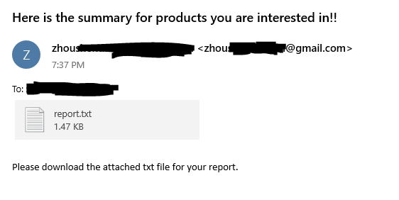
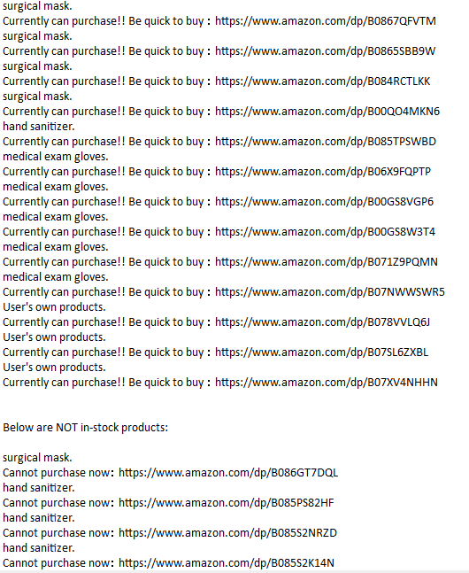
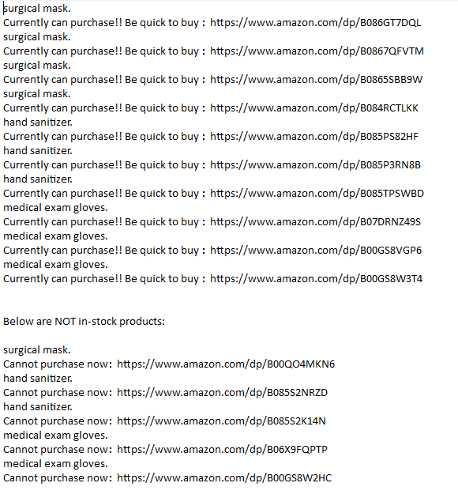
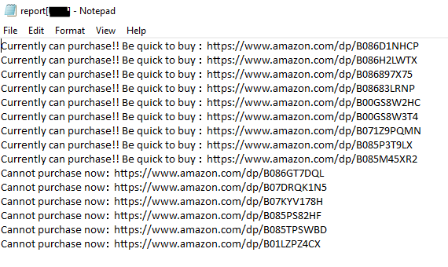
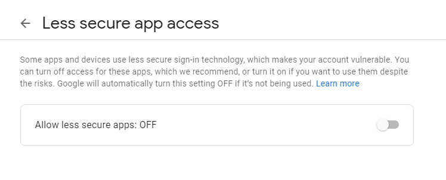
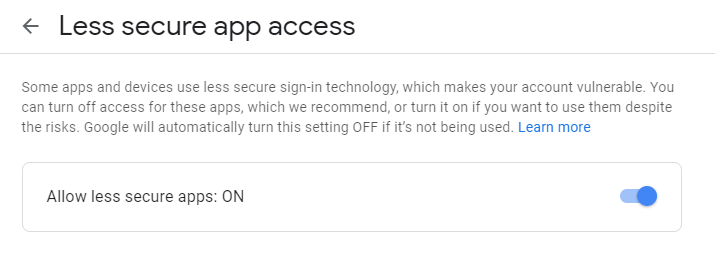

During this serious Coronavirus period, hope my Arrival Notices project for products (like surgical mask :mask:, hand sanitizer :open_hands:, Medical Exam Gloves :snowman:) in market (Amazon) can help a little bit. :heart:    

<hr>   

# ProductsArrivalNotices   
<b>[Current Version - V3]</b>     
1. This project can help you check whether 3 kinds (face mask, hand sanitizer, Medical Exam Gloves) of good-quality products (5 best sellers) in Amazon for protecting yourself in serious coronavirus period can be purchased now or not.     
2. This project can help you detect the process of product in a while loop, it will send you email automatically and repeatedly until you shuts down the program.     
3. This project can automaticly detect and update 5 best-seller links from best-seller products page (like the link below: https://www.amazon.com/Best-Sellers-Industrial-Scientific-Medical-Exam-Gloves/zgbs/industrial/8404645011) for 3 medical category in Amazon.     
4. Store privacy information in a text, my main program can extract infromation from text.     
5. Can let user type in link(s) for their ideal products. 

<b>[First Version & Second Version - V1 & V2]</b>     
1. This project can help you check whether 3 kinds (face mask, hand sanitizer, Medical Exam Gloves) of good-quality products (5 best sellers) in Amazon for protecting yourself in serious coronavirus period can be purchased now or not.     
2. This project can help you detect the process of product in a while loop, it will send you email automatically and repeatedly until you shuts down the program.     
3. This project can automaticly detect and update 5 best-seller links from best-seller products page (like the link below: https://www.amazon.com/Best-Sellers-Industrial-Scientific-Medical-Exam-Gloves/zgbs/industrial/8404645011) for 3 medical category in Amazon.      


## Demo   
<b>Demo video for current version can be viewed [here](https://www.youtube.com/watch?v=iWX8yRLhQ8w&feature=youtu.be). </b>        
Demo video for V2 can be viewed [here](https://www.youtube.com/watch?v=lhLaC7M329c&feature=youtu.be).         
Demo video for V1 can be viewed [here](https://www.youtube.com/watch?v=4Alm5tWSpkE&feature=youtu.be).       

### Images gallery    
Demo images for this project can viewed below.     
#### <b>Content of email will be looked like below:</b>       
       

#### <b>Current attachment looks like below:</b>         
     
     
#### Previous attachment looks like below:    
##### Version 2:    
     
##### Version 1:    
     


## How to set up this project?    
First, please clone/download my project.    
```
git clone https://github.com/zhou-1/productsArrivalNotices.git    
```

Second, in main_program_V1/main.py file, add in your own gmail address, password of your gmail, and email address you would like to send email to.   
```
# email address used to send to; any email address is fine
TO = 'XXXXX@outlook.com'
# Gmail Sign In
gmail_sender = 'XXXX@gmail.com'
gmail_passwd = 'XXXXXX'
```
You can also change the contents for subject, text of email if you like:    
```
# email subject
SUBJECT = 'Here is the summary for products you are interested in!!'
# contents of email
# TEXT = 'Product of below link is in stock currently: ' + str(url) 
# error may be number/size of text
# Send an attachment for report
TEXT = "Please download the attached txt file for your report."
```

Third, in your terminal, type in:    
```
python main.py     
```
The program will run automatically and send report as attachment to your email.    

### What you need?     
Python 3     
Libraries needed in Python:   
1. requests     
2. time    
3. smtplib        
4. email      
5. lxml    


## Core parts   
Currently, there are 3 core parts in my program.    
### 1. Send email in Gmail with Python     
Send email in gmail account with Python.     
Here will be one popular quetion for "Login credentials with Gmail SMTP".      
You could change the security level for SMTP Authentication Error in this link: https://support.google.com/accounts/answer/6010255     
If you find the current status of security level is off like below image shows:     
      
After you trun on the security level, the status will show like velow image:    
     


### 2. Check availiabilty in website (Amazon)     
Checking availaility in amazon website with product's ID.    

```
# checking availaility 
XPATH_AVAILABILITY = '//div[@id ="availability"]//text()'
RAw_AVAILABILITY = doc.xpath(XPATH_AVAILABILITY) 
AVAILABILITY = ''.join(RAw_AVAILABILITY).strip()
```

This will return the result of product's availabilty based on its ID.    


### 3. Check Top 5 products from Amazon's Best Seller page        
Checking Top 5 best seller products from recommanded page.   

```
# check for product link in href
XPATH_HREF = '//span[@class = "aok-inline-block zg-item"]/a[@class ="a-link-normal"]/@href'
RAw_HREF = doc.xpath(XPATH_HREF) 
#print(type(RAw_HREF)) # list
```

This will return a list for links for those 5 best-seller products.    


